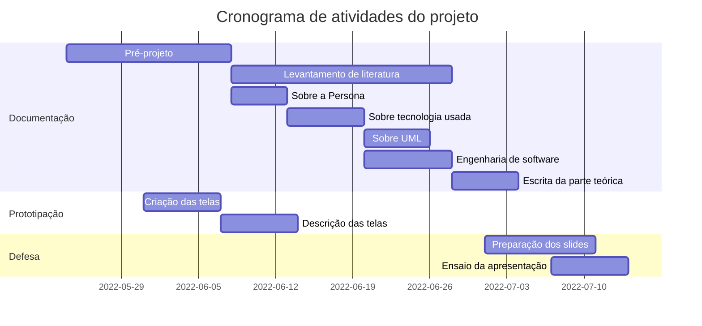

# Cronograma do Projeto Integrador
Cronograma da Disciplina de Projeto Integrador

```mermaid
    gantt
    title Cronograma de atividades do projeto
    dateFormat  YYYY-MM-DD
    section Documentação
    Pré-projeto :a1, 2022-05-24, 15d
    Levantamento de literatura :a2,after a1  , 20d
    Sobre a Persona :a3,after a1  , 5d
    Sobre tecnologia usada :a4,after a3  , 7d
    Sobre UML :a5,after a4  , 6d
    Engenharia de software :a6,after a4  , 8d
    Escrita da parte teórica :a7,after a2  , 6d
    section Prototipação
    Criação das telas :c2,2022-05-31  , 7d
    Descrição das telas      :c3,after c2, 7d
    section Defesa
    Preparação dos slides :p1, 2022-07-01, 10d
    Ensaio da apresentação :p2, 2022-07-07, 7d
```
## Aluno: José Ricardo Quintino Vidal
