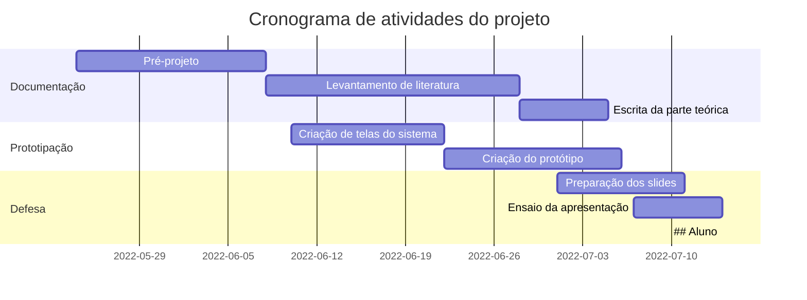

# Cronograma do Projeto Integrador
Cronograma da Disciplina de Projeto Integrador

```mermaid
    gantt
    title Cronograma de atividades do projeto
    dateFormat  YYYY-MM-DD
    section Documentação
    Pré-projeto     :a1, 2022-05-24, 15d
    Levantamento de literatura   :a2,after a1  , 20d
    Escrita da parte teórica  :a3,after a2, 7d
    section Prototipação
    Criação de telas do sistema     :c2,2022-06-10  , 12d
    Criação do protótipo      :c3,after c2, 14d
    section Defesa
    Preparação dos slides :p1, 2022-07-01, 10d
    Ensaio da apresentação :p2, 2022-07-07, 7d
    ## Aluno: José Ricardo Quintino Vidal
```
